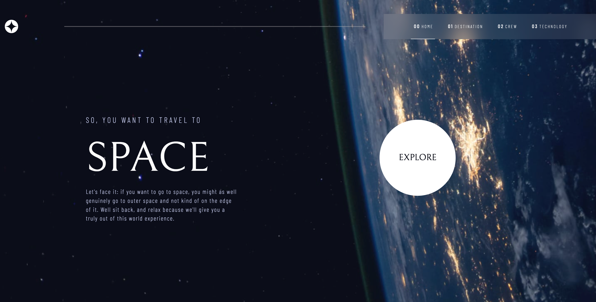

# Frontend Mentor - Space tourism website solution

This is a solution to the [Space tourism website challenge on Frontend Mentor](https://www.frontendmentor.io/challenges/space-tourism-multipage-website-gRWj1URZ3). Frontend Mentor challenges help you improve your coding skills by building realistic projects. 

## Table of contents

- [Overview](#overview)
  - [The challenge](#the-challenge)
  - [Screenshot](#screenshot)
  - [Links](#links)
- [My process](#my-process)
  - [Built with](#built-with)
  - [What I learned](#what-i-learned)
  - [Continued development](#continued-development)
  - [Useful resources](#useful-resources)
- [Author](#author)

## Overview

### The challenge

Users should be able to:

- View the optimal layout for each of the website's pages depending on their device's screen size
- See hover states for all interactive elements on the page
- View each page and be able to toggle between the tabs to see new information

### Screenshot



### Links

- Solution URL: [https://github.com/farhan-navas/space-tourism-website](https://github.com/farhan-navas/space-tourism-website)

## My process

### Built with

- Semantic HTML5 markup
- CSS custom properties
- Flexbox
- CSS Grid
- Mobile-first workflow
- [React](https://reactjs.org/) - JS library

### What I learned

For this project I wanted to make use of React Class-based Components, however not much of my React knowledge was used as this was project was pretty straightforward. All I had to do was extract the data from a JSON file and display it on these 4 different webpages. Coding the logic and the content of the website took very little time, but I found styling very difficult, and I used plain CSS throughout this project. This project was very styling-heavy so I got a better grasp of CSS concepts such as flexbox, position, margin, padding & media queries. For the explore button managed to make a solution by myself using the box-shadow instead of a ::after selector. Changing the backgrounds for different pages which contained similar components was alsoa pretty difficult task.

One particular thing that I am proud of in this project is coming up with a way write the logic for the hamburger navigation bar, when in mobile display. This was one of the hardest sections for me and some of the code is below. These functions would toggle this.state.media when the page display changed, and in turn I was able to display and hide diff elements.

```js
componentDidMount() {
    const handler = (e) => this.setState({ media: e.matches })
    window.matchMedia("(max-width: 375px)").addEventListener('change', handler)
}

handleOpen(e) {
    e.target.classList.add('hidden')
    const links = document.getElementById('links')
    const navBar = document.getElementById('NavBar')
    navBar.style.height = '100vh'
    links.style.height = '100%'
    links.classList.remove('hidden')
}
```

### Continued development

One mistake I realised far too late, was that maybe I could have used a single CSS file that contained different classes and then I could have applied it to all. Still not very sure how that will work, but it is just an idea for now. I would also like to learn the usage of React Hooks then I will not have to write such lengthy code. I also aim to incorporate the use of Tailwind CSS in my next project, instead of using just regular css. Also need to figure out how to add a live site url if I am using CRA.

### Useful resources

- [React Router](https://www.youtube.com/watch?v=Ul3y1LXxzdU&t=17s&ab_channel=WebDevSimplified) - This helped me to learn about React Routers and he gave a easily understandable explanation.
- [StackOverflow](https://stackoverflow.com/) - One stop solution for all my problems

## Author

- Frontend Mentor - [@wakandakings](https://www.frontendmentor.io/profile/wakandakingz)
- Github - [@farhan-navas](https://www.github.com/farhan-navas)


